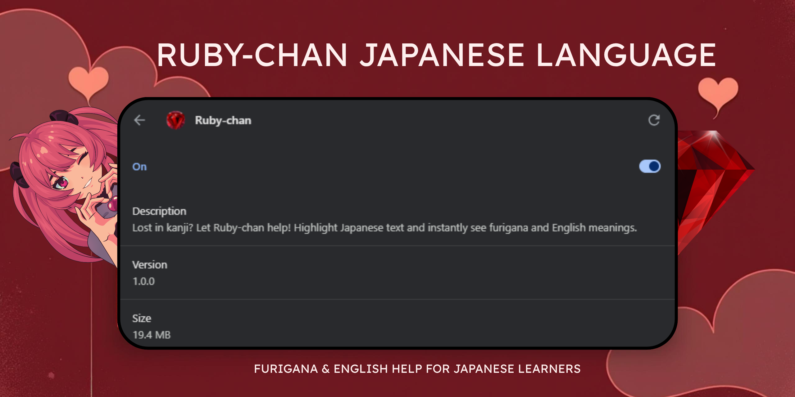

# Ruby-chan

**Ruby-chan** is a Chrome Extension that adds _furigana_ and English definitions to selected Japanese text on any website, designed to support Japanese learners in reading kanji-rich content.

---

## Features

- 📖 Automatically adds **furigana** (pronunciation guides) to kanji
- 🌍 Shows **English definitions** with contextual meaning
- ⚡ Lightweight and fast, runs directly in-browser
- 💾 Caching system to avoid repeated API calls (works offline after fetch)
- 🧠 Built with **Kuromoji.js** and **Jisho API**

---

## Screenshots

| Screenshot                                 | Description                                                                |
| ------------------------------------------ | -------------------------------------------------------------------------- |
|  | Highlight Japanese text and see real-time furigana and English definitions |
|    | Popup UI showing reading and meaning for kanji words.                      |
|      | Click to hear how each kanji word is pronounced.                           |

> 📌 _Screenshots can be found in the `/screenshots/` folder_

---

## How to Use (Locally)

Since Ruby-chan is not yet published to the Chrome Web Store, you can run it locally:

1. Clone or download this repository
2. Open **Chrome > Extensions (chrome://extensions)**
3. Turn on **Developer Mode**
4. Click **Load Unpacked**
5. Select the project folder (where `manifest.json` is located)
6. Pin Ruby-chan and start highlighting Japanese text!

---

## Technologies Used

- JavaScript (Vanilla)
- Manifest V3
- [Kuromoji.js](https://github.com/takuyaa/kuromoji.js)
- [Jisho API](https://jisho.org/api/v1/search/words?keyword=xxx)
- Chrome Storage API

---

## Background

I created Ruby-chan from personal need. As a Japanese learner, I often struggled with reading native content online due to lack of furigana or translations. This extension bridges that gap by offering in-place reading assistance without leaving the page.

---

## Changelog

Track updates and new features in the [CHANGELOG.md](CHANGELOG.md).

---

## License

This project is licensed under the [MIT License](LICENSE).
